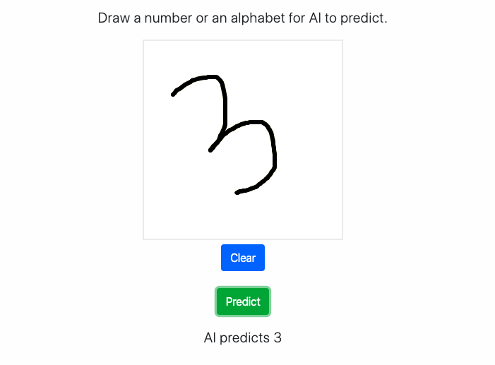

# Digital Slate

A slate for kids playing guessing game with AI by drawing number or alphabets

Check out the app: [Digital Slate](https://digital-slate.herokuapp.com)

This webapp is a modified version of two must read blogs: 
* [Paperspace Blog 1](https://blog.paperspace.com/deploying-deep-learning-models-flask-web-python/) 
* [Paperspace Blog 2](https://blog.paperspace.com/deploying-deep-learning-models-part-ii-hosting-on-paperspace/)

The JS and CSS scripts are credited to the original author.

